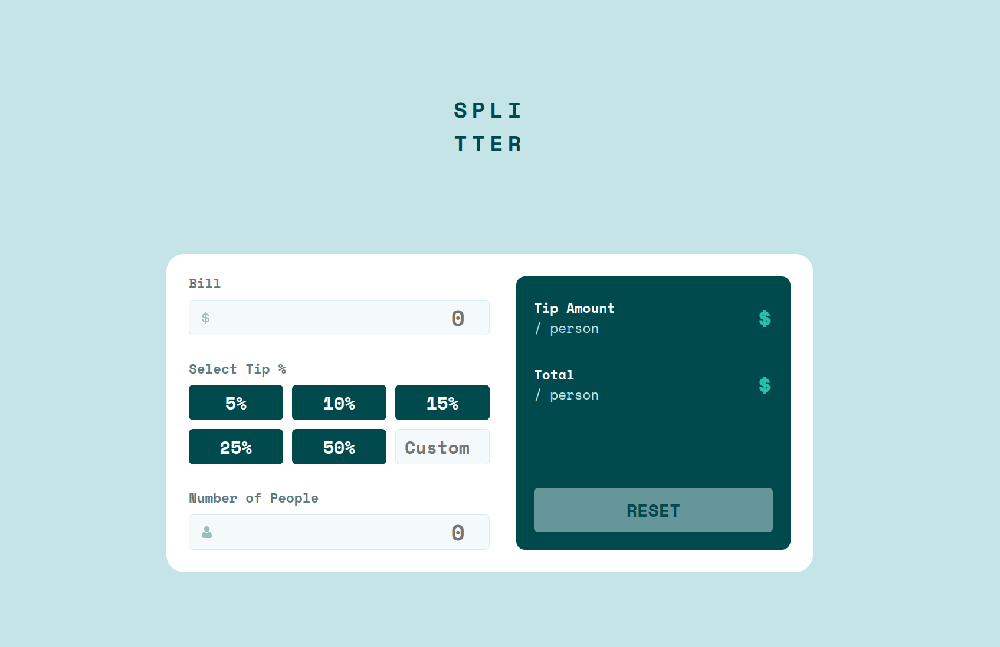

# Frontend Mentor - Tip calculator app solution

This is a solution to the [Tip calculator app challenge on Frontend Mentor](https://www.frontendmentor.io/challenges/tip-calculator-app-ugJNGbJUX). I build it using react and styled-components.

## Table of contents

- [Overview](#overview)
    - [The challenge](#the-challenge)
    - [Screenshot](#screenshot)
    - [Links](#links)
- [My process](#my-process)
    - [Built with](#built-with)
    - [What I learned](#what-i-learned)
    - [Useful resources](#useful-resources)
- [Author](#author)

## Overview

### The challenge

Users should be able to:

- View the optimal layout for the app depending on their device's screen size
- See hover states for all interactive elements on the page
- Calculate the correct tip and total cost of the bill per person

### Screenshot

### Links

- Solution URL: [on github](https://github.com/r-yadav01/fm-tip-component-app)
- Live Site URL: [Add live site URL here](https://your-live-site-url.com)

## My process

### Built with

- Semantic HTML5 markup
- CSS custom properties
- Flexbox
- CSS Grid
- Mobile-first workflow
- [React](https://reactjs.org/) - JS library
- [Styled Components](https://styled-components.com/) - For styles

### What I learned

I picked up this project because I wanted to try styled-components, and I found out that it is pleasant to use with reactjs.

### Useful resources

- [Josh's blog on styled-components](https://www.joshwcomeau.com/react/demystifying-styled-components/) - This helped me to learn how to use styled-components in a react context.
- [Thinking in react](https://react.dev/learn/thinking-in-react) - This is an amazing article which helped me finally understand the basic workflow to use while creating a react project.

## Author

- GitHub - [r-yadav01](https://github.com/r-yadav01)
- Frontend Mentor - [@r-yadav01](https://www.frontendmentor.io/profile/r-yadav01)
- Twitter - [@r_yadav01](https://x.com/r_yadav01)
- Bluesky - [@r-yadav01.bsky.social](https://bsky.app/profile/r-yadav01.bsky.social)
